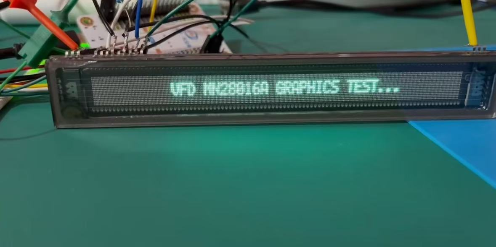

# MN28016A-STM32
> VFD Display. 280x16 dot matrix screen using PlatfromIO Esp32 driver

This is a use of STM32 HAL framework to drive VFD display model: MN28016A
The code successfully realized the screen automatically and constantly refreshed, and drive the implementation of the drawing point function.

## Usage
- SPI protocol DMA method is used to continuously fetch data from the buffer for scrubbing
- The send_buffer function takes data from the screen bitmap buffer and converts it to VFD protocol data, modifying it into the DMA buffer
- Use EIDE Vscode plug-in